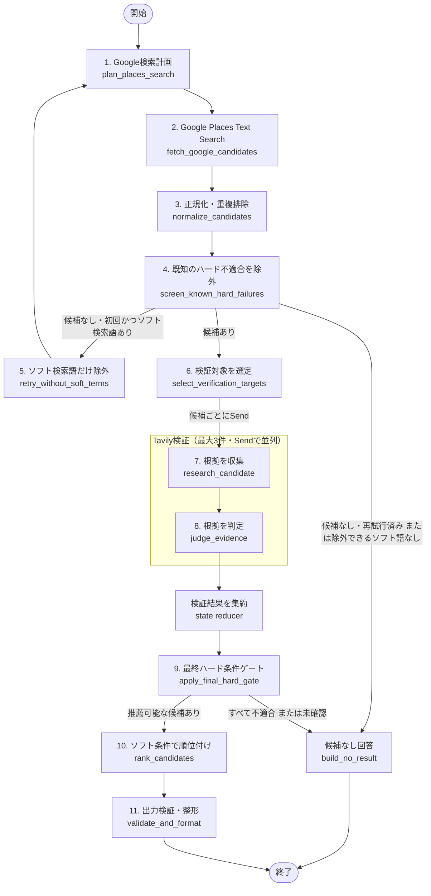

# Izakaya Finder 仕様書（下書き）

- ドキュメント版: v0.1-draft
- 作成日: 2026-02-21
- 対象リポジトリ: `izakaya-finder`

## 1. 目的

ユーザーの希望条件（場所、人数、雰囲気、飲み放題可否、ビール必須など）をもとに、居酒屋候補を収集・評価し、理由付きでおすすめ順に提示する。

## 2. スコープ

### 2.1 対象

- 居酒屋候補の入力条件定義
- 候補データの保持
- ランキング結果の保持
- 要約文の生成
- 将来的な LLM/外部API連携の基盤

### 2.2 非対象（現時点）

- 本番向け UI（現状は Next.js 初期テンプレート）
- 完成済み API エンドポイント
- 認証・課金・管理画面

## 3. 想定ユーザー

- 飲み会幹事
- 少人数で店探しをしたい個人
- 条件付きで店を絞り込みたいユーザー

## 4. 用語

- Candidate: 検索で得られた店舗候補
- RecommendationItem: 評価後の推薦結果
- SearchState: 検索処理全体の状態

## 5. 機能要件（ドラフト）

### 5.0 スキーマ役割整理（LangGraph）

- `IzakayaSearchRequestSchema`
  - ユーザー入力（検索条件）を表すスキーマ
  - `SearchState.request` の型として利用する
- `CandidateSchema`
  - 候補店舗1件を表すスキーマ
  - `SearchState.candidates` の配列要素として利用する
- `RecommendationItemSchema`
  - 推薦結果1件を表すスキーマ
  - `SearchState.ranked` の配列要素として利用する
- `SearchStateSchema`
  - LangGraph 全体で受け渡す状態スキーマ
  - `request`, `candidates`, `ranked`, `summary`, `traceId`, `traceUrl` を含む

#### Node return の考え方

- 各ノードは `SearchState` 全体を受け取る
- 各ノードの return は「state 全体」ではなく「更新したいキーのみ」を返す
  - `fetchCandidates` は `candidates` を更新
  - `rankCandidates` は `ranked` を更新
  - `buildSummary` は `summary` を更新
- これにより、段階処理（候補収集→順位付け→要約）を安全に分離できる

### 5.1 入力条件

`IzakayaSearchRequestSchema`（`ai-api/schemas/izakaya.ts`）

- `area`: エリア指定（最優先）
  - `mode`: `current_location | station_input`
  - `station`: 駅名（`station_input` のとき必須）
  - デフォルトは現在地。位置情報が使えない場合は駅名入力へフォールバック
  - 駅入力はサジェスト対応（例: 新宿 / 渋谷 / 池袋）
- `people`: 人数
  - `1〜50` の整数で指定
- `budget`: 予算
  - `up_to_3000 | up_to_5000 | up_to_8000 | unspecified`
- `allYouCanDrink`: 飲み放題重視フラグ（既存仕様を維持、既定 `false`）
- `beerRequired`: ビール必須フラグ（既存仕様を維持、既定 `false`）
- `moodTags`: 雰囲気（複数選択）
  - `waiwai | calm | date | colleagues | solo | with_boss`
- `preferences`: こだわり自由記述（任意）
  - 例: 「禁煙で個室希望。終電後も営業している店」

### 5.1.1 UI操作仕様（入力）

- 画面下固定ボタン: 「この条件で探す」
- 条件が少ない場合は「おすすめで探す」導線を表示可能にする
- 現在地が許可されない場合は、駅名入力UIへ自動遷移する

### 5.2 候補データ保持

`Candidate`（`ai-api/graphs/izakayaSearchGraph.ts`）

- 基本情報: `placeId`, `name`, `address`, `lat`, `lng`
- 補助情報: `rating`, `userRatingsTotal`, `priceLevel`, `website`, `googleMapsUrl`, `editorialSummary`
- 口コミ: `reviewsText[]`

### 5.3 推薦結果保持

`RecommendationItem`（`ai-api/graphs/izakayaSearchGraph.ts`）

- `score` による順位付け
- `reasons[]` による説明
- `evidence` による条件一致根拠（飲み放題/ビール）
- `meta` に店舗メタ情報を保持

### 5.4 処理状態

`SearchState`（`ai-api/graphs/izakayaSearchGraph.ts`）

- `request`, `candidates`, `ranked`, `summary`
- トレーシング情報: `traceId`, `traceUrl`

## 6. 処理フロー（目標）

1. 入力を `zod` で検証
2. 条件に基づいて候補店舗を収集
3. 候補をスコアリング
4. 上位候補を理由付きで整形
5. 全体要約を生成
6. 結果を JSON で返却

## 7. API 仕様（案）

### 7.1 エンドポイント

- `POST /api/izakaya/search`

### 7.2 リクエスト例

```json
{
  "area": {
    "mode": "station_input",
    "station": "渋谷"
  },
  "people": 4,
  "budget": "up_to_5000",
  "moodTags": ["waiwai", "colleagues"],
  "preferences": "禁煙で個室希望",
  "allYouCanDrink": true,
  "beerRequired": false
}
```

### 7.3 レスポンス例

```json
{
  "request": {
    "area": {
      "mode": "station_input",
      "station": "渋谷"
    },
    "people": 4,
    "budget": "up_to_5000",
    "moodTags": ["waiwai", "colleagues"],
    "allYouCanDrink": true,
    "beerRequired": false
  },
  "candidates": [],
  "ranked": [
    {
      "placeId": "abc",
      "name": "居酒屋A",
      "address": "東京都...",
      "score": 87,
      "reasons": ["飲み放題プランあり", "レビュー評価が高い"],
      "evidence": {
        "allYouCanDrinkHit": "飲み放題コースあり"
      },
      "meta": {
        "rating": 4.2,
        "userRatingsTotal": 530,
        "priceLevel": 2,
        "googleMapsUrl": "https://..."
      }
    }
  ],
  "summary": "4名利用に適した、飲み放題対応の候補を優先しました。"
}
```

### 7.4 結果表示と Streaming 方針

検索ボタン押下後は、検索リクエストを `Search` レコードとして保存し、結果表示ページへ遷移する。

- 送信直後に `Search` レコードを作成する
  - 初期状態は `pending` 相当として扱う
  - リクエスト内容、人数、予算、飲み放題/ビール条件、雰囲気、自由記述を保存する
- 作成した `Search.id` を使って `/results/[id]` へ redirect する
- `/results/[id]` は結果表示用の Server Component とする
  - 初期表示では保存済み request を読み取る
  - 生成中 UI は Client Component に分離する
- 段階的な AI 生成表示は AI SDK の `streamText` を使う方針とする
  - streaming 用 Route Handler 例: `src/app/api/results/[id]/stream/route.ts`
  - Client Component から streaming Route Handler を呼び出し、受信した chunk を順に画面へ反映する
  - 生成完了後に最終結果を `Search.result` / `Search.summary` へ保存する

初期段階の表示ステップは以下を想定する。

1. 候補を探しています
2. 候補を評価しています
3. 要約を作成しています
4. 完了

設計上の責務分離:

- `src/app/_actions/izakayaSearch.ts`
  - Server Action としてフォーム送信を受ける
  - 検索作成ユースケースを呼び出す
  - 作成済み `Search.id` を使って `/results/[id]` へ redirect する
- `src/app/lib/server/izakayaSearch/formSchema.ts`
  - `FormData` をフォーム入力スキーマで検証する
  - `"true"` / `"false"` などのフォーム文字列を boolean へ変換する
  - 最終的に `IzakayaSearchRequestSchema` で内部検索リクエストとして再検証する
- `src/app/lib/server/izakayaSearch/createSearch.ts`
  - フォーム変換後の検索リクエストから Graph 実行用 state を作る
  - `graph.invoke(...)` を実行する
  - 検索結果を repository 経由で保存する
- `src/app/lib/server/izakayaSearch/searchRepository.ts`
  - Prisma による `Search` レコードの保存・取得を担当する
  - `Search.result` は `SearchStateSchema` で検証してから結果ページへ渡す
- `src/app/results/[id]/page.tsx`
  - `Search.id` をもとに server repository から request / result を読み取る
  - 結果表示の枠を提供する Server Component とする
- `src/app/results/[id]/...` の Client Component
  - streaming の受信状態を保持する
  - 生成中の文言や段階的な AI 出力を描画する
- `src/app/api/results/[id]/stream/route.ts`
  - AI SDK `streamText` を使って生成結果を streaming する
  - 完了時に DB へ最終結果を保存する

参考:

- Next.js Route Handler streaming: https://nextjs.org/docs/app/api-reference/file-conventions/route#streaming
- Next.js loading / Suspense streaming: https://nextjs.org/learn/dashboard-app/streaming
- AI SDK `streamText`: https://ai-sdk.dev/docs/reference/ai-sdk-core/stream-text

## 8. 非機能要件（ドラフト）

- 型安全: TypeScript + `zod`
- 観測性: `traceId`, `traceUrl` を保持可能にする
- 保守性: LangGraph state を中心に責務分離
- パフォーマンス: 候補収集と評価の段階を分け、将来並列化可能な構造にする

## 9. 技術スタック（現状）

- Next.js 16
- React 19
- TypeScript
- Go（backend API）
- LangChain / LangGraph
- Zod
- OpenAI SDK（導入済み）
- Google GenAI 連携パッケージ（導入済み）
- AI SDK（導入予定: `streamText` による生成結果の段階表示）

## 10. リポジトリ構成方針（現状と将来）

### 10.1 現状の考え方

- 現在は単一リポジトリ内に役割別ディレクトリを置く構成とする
- `src/app/` は Next.js App Router の画面と API Route の入口を担当する
- `ai-api/` は AI による候補収集、順位付け、要約生成などの処理を担当する
- `backend/` は Go によるユーザー向け API と駅候補管理を担当する
- この段階では「1つのアプリをフォルダで整理している状態」であり、まだモノレポ化はしていない

### 10.1.1 Go backend の責務

- `backend/` は Next.js / LangGraph から独立した Go API として実装する
- 初期責務は以下に絞る
  - ヘルスチェック
  - 駅サジェスト
  - ユーザーごとの駅設定（自宅・よく使う駅など）
- 居酒屋検索 AI 本体は当面 `ai-api/` の TypeScript / LangGraph 側に残す
- 認証は将来的に AWS Cognito を使う方針
  - 現時点では `AUTH_MODE=none|dev|cognito` の設定受け口を用意する
  - `cognito` モードの JWT 検証は未実装で、今後の追加対象とする

### 10.2 モノレポ化に関する判断

- 将来的にはモノレポ構成へ移行する方針とする
- ただし、現時点では開発初期のため、無理に分割せずルート直下構成を優先する
- `backend/` や AI 処理が独立した実行単位、デプロイ単位として必要になったタイミングで切り出す
- モノレポは「複数アプリや共通パッケージを1つのリポジトリで管理する方法」として扱う
- マイクロサービス化は別の設計判断であり、モノレポと同義ではない

### 10.3 将来の想定ディレクトリ例

```text
apps/
  web/        Next.js の画面
  backend/    API サーバー
  ai-api/     AI 処理サービス
packages/
  shared/     zod schema / TypeScript 型 / 共通ロジック
  ui/         共通 UI コンポーネント
```

### 10.4 モノレポ化の狙い

- `web`、`backend`、`ai-api` の責務を明確にする
- 共通の `zod` schema や TypeScript 型を `packages/shared` で再利用しやすくする
- 将来のデプロイ分離に備えつつ、コード管理は1つのリポジトリにまとめる
- 開発初期は複雑化を避け、必要になった時点で段階的に移行する

## 11. 現状実装状況

### 11.1 実装済み

- 入力スキーマ定義（`ai-api/schemas/izakaya.ts`）
- 検索状態/型定義（`ai-api/graphs/izakayaSearchGraph.ts`）
- SearchGraph 本体の接続
  - `START -> fetchCandidates -> rankCandidates -> buildSummary -> END`
- 候補収集ノード（`ai-api/graphs/nodes/fetchCandidatesNode.ts`）
  - `SearchState.request` をもとに LLM へ候補収集を依頼
  - `Candidate[]` を `zod` で検証して返却
- ランキングノード（`ai-api/graphs/nodes/rankCandidatesNode.ts`）
  - `request` と `candidates` をもとに LLM へ順位付けを依頼
  - `RecommendationItem[]` を `zod` で検証して返却
- 要約ノード（`ai-api/graphs/nodes/buildSummaryNode.ts`）
  - `request` と `ranked` をもとに LLM へ要約生成を依頼
  - `{ summary: string }` を返却
- API Route（`src/app/api/izakaya/search/route.ts`）
  - `req.json()` を `IzakayaSearchRequestSchema` で検証
  - `createInitialSearchState(...)` を生成して `graph.invoke(...)` を実行
  - 成功時は Graph の最終 state を JSON 返却
  - バリデーションエラーは `400`、その他は `500`
- Server Action / server usecase の責務分離
  - `src/app/_actions/izakayaSearch.ts`
    - フォーム送信の入口として `createIzakayaFromForm(...)` を呼び、作成済み検索IDへ redirect
  - `src/app/lib/server/izakayaSearch/formSchema.ts`
    - `FormData` をフォーム入力スキーマで検証
    - `z.enum(["true", "false"]).transform(...)` で boolean へ変換
    - `IzakayaSearchRequestSchema` で内部検索リクエストとして最終検証
  - `src/app/lib/server/izakayaSearch/createSearch.ts`
    - Graph 実行と DB 保存をまとめる検索作成ユースケース
  - `src/app/lib/server/izakayaSearch/searchRepository.ts`
    - Prisma による `Search` 保存と取得の入口
- 結果表示ページの初期実装
  - `src/app/results/[id]/page.tsx`
    - URL の `id` を取得
    - `findSearchResultById(id)` で保存済み検索結果を取得
    - `ranked` を走査し、現状は各候補の評価値と Web サイト URL だけを仮表示する
  - `src/app/results/[id]/components/result_card/index.tsx`
    - 推薦結果カードの雛形を追加済みだが、描画・ページへの統合は未実装
- Go backend 方針（`backend/`）
  - `GET /health`
  - `GET /stations/suggestions?q=渋`
  - `GET /users/me/stations`
  - `POST /users/me/stations`
  - 初期実装案は標準ライブラリのみで、ユーザー駅設定はインメモリ保持
  - 現時点では方針整理段階であり、実ファイルは未追加
- Graph 関連の TypeScript 型チェック
  - `pnpm -s tsc --noEmit` 上、Graph 関連では追加エラーなし
  - 残件は `sample.ts` の別件エラーのみ

### 11.2 未実装・要修正

- API Route の疎通確認
- UI 画面
  - `/results/[id]` は評価値と Web サイト URL の仮表示まで実装済み
  - `summary`、店舗名、住所、理由、スコア、リンクを含む一覧表示は未実装
  - `findSearchResultById` は `SearchStateSchema.parse(...)` の結果を返却済み
  - 存在しない `Search.id` の扱いは `throw new Error(...)` ではなく `notFound()` へ寄せる
- Langfuse 連携の最小完成
  - `src/app/api/izakaya/search/route.ts` には Langfuse callback 呼び出しがある
  - ただし、環境変数未設定時の扱い、命名 typo、`traceId` / `traceUrl` の state 反映は未整理
  - 現状は「未着手」ではなく「途中実装」として扱う
- Cognito JWT 検証
- Go backend の永続化（DB）
- スコアリング/候補抽出の精度改善

### 11.3 API Route 疎通後の確認観点

- `POST /api/izakaya/search` の疎通後は、返却 JSON の内容を以下の観点で確認する
  - `candidates` が 5〜10 件程度返っているか
  - `ranked` が `score` 順に並んでいるか
  - `reasons` が入力条件に合った説明になっているか
  - `summary` が自然な日本語で、入力条件に触れているか
- 特に店舗の実在性を確認する
  - 現状の `fetchCandidates` は LLM による候補生成のため、店名・住所・Google Maps URL の実在保証が弱い
  - 次の改善候補として、`fetchCandidates` を Google Places API などの実データ取得へ寄せる

### 11.4 Google Places による候補取得方針（2026-08-01）

- 駅名入力から居酒屋候補を取得する初期実装では、Google Places API の Text Search (New) を使用する
  - 検索クエリは「`{駅名}駅 居酒屋`」を基本とする
  - Google Places は実在する候補店舗の収集を担当し、ユーザーの詳細条件との整合性評価は後段へ分離する
- Nearby Search (New) は現時点では使用しない
  - Nearby Search には、中心座標と半径を指定して「半径何 m 以内」を厳密に絞り込める利点がある
  - 現在の要件は「駅周辺から 5〜10 件程度の候補を取得すること」であり、厳密な半径指定を必要としていない
  - Text Search で駅名と居酒屋カテゴリを同時に検索できるため、駅の緯度・経度を取得してから Nearby Search を呼ぶ追加処理は、現段階では設けない
- 以下の要件が追加された場合は、Nearby Search の導入を再検討する
  - 駅から半径 500 m 以内など、検索範囲を厳密に保証する
  - 現在地を中心に候補を検索する
  - 距離順の候補表示や、検索範囲の明示が必要になる

### 11.5 候補取得・根拠検証フロー（2026-08-01）

推薦の不変条件は「再検索時にソフト条件を検索語から外すことはあっても、ハード条件を満たさない店舗は推薦しない」とする。

Tavilyによる候補ごとの根拠収集には、必ず上限を設ける。初期値は次のとおりとし、`select_verification_targets`はこの件数を超える候補を`research_candidate`へ送らない。

```ts
const MAX_TAVILY_TARGETS = 3;
```

これにより、検索リクエストごとの待ち時間、API利用量、並列実行数を予測可能に保つ。上限超過の候補はGoogleの構造化データによる一次判定までに留め、Tavily検証対象の優先順位は未確認のハード条件、自由記述との関連性、Google評価を基準に決める。



構造化されたUI入力は、LLMによる `parse_intent` で再解析しない。`area`、`people`、`budget`、`allYouCanDrink`、`beerRequired` は入力時点でハード条件として扱い、`moodTags` は原則ソフト条件とする。`preferences` がある場合だけ、必要に応じて自由記述からハード候補・ソフト候補・判断不能条件を補助的に抽出する。

#### Node の責務

| Node | 役割 | 守るルール |
| --- | --- | --- |
| `plan_places_search` | 構造化入力からGoogle Text Searchのクエリ、店舗タイプ、FieldMaskを決める | ハード条件を記録し、検索クエリへの採用有無と最終条件判定を混同しない |
| `fetch_google_candidates` | Google Text Searchで実在候補を取得する | `placeId`を以後の店舗識別子として保持する |
| `normalize_candidates` | `Candidate`へ変換し、`placeId`重複、閉業・移転済み候補を整理する | 同一店舗を二重評価しない |
| `screen_known_hard_failures` | Googleの構造化データで明確にハード不適合な候補だけを除外する | 情報不足は`unknown`として残し、この時点では除外しない |
| `retry_without_soft_terms` | 初回検索に含めたソフト検索語だけを除外して再検索する | 駅、人数、予算、飲み放題などのハード条件は外さず、再試行は1回までとする |
| `build_no_result` | 推薦可能な候補がないことを返す | ハード条件を緩和した店舗を代替推薦として混ぜない |
| `select_verification_targets` | Tavilyで検証する候補を `MAX_TAVILY_TARGETS = 3` 件までに絞る | ハード条件が`unknown`の候補や自由記述に関係する候補を優先する。上限超過の候補は`research_candidate`へ送らない |
| `research_candidate` | Tavilyで公式サイト、予約サイト、メニューを調査する | `店舗名 + 住所 + 未確認条件`で検索し、根拠URLと抜粋を保存する |
| `judge_evidence` | 収集した根拠から条件ごとに`yes / no / unknown`を判定する | 根拠URLなしで`yes`にせず、曖昧な情報は`unknown`にする |
| `apply_final_hard_gate` | ハード条件を最終確認する | 全ハード条件が`yes`の候補だけを推薦対象にし、`no`は除外、`unknown`は通常推薦に入れない |
| `rank_candidates` | 通過候補をソフト条件、評価、価格、根拠の強さで並び替える | ハード条件で落ちた候補を採点しない |
| `validate_and_format` | APIレスポンスに整形し、安全性を検証する | `placeId`なし、根拠なしの断定、ハード不適合な候補を出力しない |

`state reducer` は外部APIやLLMを呼ぶNodeではない。`Send`で並列実行された候補ごとの検証結果を `verificationResults[]` に追加結合するstate更新規則である。TypeScriptのLangGraphでも、`Send`を使って候補ごとのMap-Reduce型検証を構成できる。

#### 最終ハード条件の扱い

- `yes`: 根拠により条件を満たすと確認できた。推薦対象にできる。
- `no`: 根拠により条件を満たさないと確認できた。除外する。
- `unknown`: 情報が不足している。通常の推薦一覧には入れず、必要なら「要確認候補」として別に返す。

## 12. 今後の実装優先順（提案）

1. `/results/[id]` の非 streaming 結果表示を完成する
   - `findSearchResultById(id)` が返す検証済み `result` を使う
   - レコード未存在時は `notFound()` を使う
   - `summary` に加えて `ranked` の店舗名、住所、スコア、理由、Google Maps URL を表示する
   - `pnpm -s tsc --noEmit` で型確認する
2. Server Action / server usecase / repository の責務分離を仕上げる
   - `src/app/_actions/izakayaSearch.ts` は redirect だけを担う薄い入口に保つ
   - `formSchema.ts` はフォーム文字列から内部リクエストへの変換だけを担う
   - `createSearch.ts` は Graph 実行と保存のユースケースに限定する
   - `searchRepository.ts` は Prisma と永続化形式を担当する
3. API Route + Langfuse の最小完成
   - `POST /api/izakaya/search` を実際に1回通す
   - Langfuse 環境変数が未設定でも検索 API が壊れないようにする
   - `createLangfuseCallback` / `izakayaLangGtaph` などの typo を整理する
   - 可能なら `traceId` / `traceUrl` をレスポンス state に含める
4. 候補取得を LLM 生成から実データ寄りにする
   - 現状の `fetchCandidates` は LLM に候補店舗を生成させている
   - 架空店舗混入リスクを下げるため、Google Places API の Text Search (New) で「`{駅名}駅 居酒屋`」を検索する構成へ寄せる
   - Nearby Search (New) は、厳密な半径指定または現在地検索が要件化されるまで導入を見送る
   - `11.5` のフローに沿って、Google候補取得、根拠収集、最終ハード条件ゲートを段階的に追加する
5. AI SDK streaming 方針で段階表示を追加する
6. Go backend と UI の接続（駅サジェスト・ユーザー駅設定）
7. Cognito JWT 検証の追加
8. スコアリングロジックの改善

## 13. 変更履歴

- v0.1-draft: 初版下書き作成
- 2026-04-05: Graph の3 Node実装状況と次の優先タスクを更新
- 2026-04-05: `POST /api/izakaya/search` の API Route を追加し、入力検証と Graph 起動入口を実装
- 2026-04-06: 現状の単一アプリ寄り構成と、将来のモノレポ移行方針を追記
- 2026-04-26: API Route 疎通後の返却 JSON 確認観点と、実在性改善候補を追記
- 2026-04-26: Go backend の初期責務案、駅サジェスト API 案、ユーザー駅設定 API 案、Cognito 方針を追記
- 2026-05-16: 次の優先実装を API Route + Langfuse の最小完成に整理
- 2026-05-31: 検索結果表示を `/results/[id]` と AI SDK `streamText` による streaming 方針で整理
- 2026-06-28: Server Action を `app/_actions` へ薄い入口として分離し、フォーム変換・検索作成・DB保存取得を `app/lib/server/izakayaSearch/` に整理。次の優先実装を `/results/[id]` の非 streaming 結果表示完成に更新
- 2026-07-20: Next.js の配置先を `src/app/` へ移行した現状に合わせて、実装パスと結果表示の到達点を更新。`findSearchResultById` は検証済みの `result` を返却する状態を記録。
- 2026-08-01: 駅名からの候補取得には Google Places Text Search (New) を採用し、厳密な半径指定を必要としない現段階では Nearby Search (New) を使用しない方針を記録。
- 2026-08-01: 再検索でソフト条件のみを外し、最終ハード条件ゲートで不適合・未確認候補を推薦から除外する候補取得・根拠検証フローを記録。
